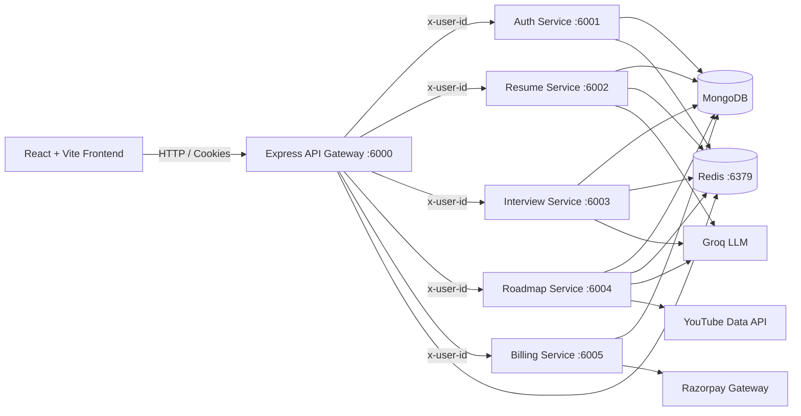

# FresherOne

[](https://react.dev/)
[](https://nodejs.org/)
[](https://expressjs.com/)
[](https://www.mongodb.com/)
[](https://redis.io/)
[](https://groq.com/)
[](LICENSE)

**FresherOne** is an AI-powered career preparation platform designed for students and early-career software developers. It brings together automated resume scoring, realistic AI-driven mock interviews, custom roadmap generation, and a tokenized coin billing system in a decoupled microservices architecture.

---

## 📑 Table of Contents

- [Key Features](#-key-features)
- [System Architecture](#-system-architecture)
- [Repository Layout](#-repository-layout)
- [Tech Stack & External Services](#-tech-stack--external-services)
- [Prerequisites](#-prerequisites)
- [Environment Configuration](#-environment-configuration)
- [Local Setup & Execution](#-local-setup--execution)
- [Frontend Routes](#-frontend-routes)
- [API Gateway Reference](#-api-gateway-reference)
- [Core Data & AI Workflows](#-core-data--ai-workflows)
- [Data Models](#-data-models)
- [Troubleshooting](#-troubleshooting)
- [Security & Production Considerations](#-security--production-considerations)
- [License](#-license)

---

# Key Features

## 1. Google Authentication

- Seamless user onboarding and authentication using **Firebase Authentication**.
- Firebase Client SDK handles authentication on the frontend.
- Firebase Admin SDK securely verifies authentication tokens on the backend.

## 2. ATS Resume Analyzer

- Supports **PDF resume uploads up to 20 MB**.
- Extracts resume text using **`pdf-parse`**.
- Uses a **Groq-powered LLM** for AI-based resume analysis.
- Generates:
  - ATS-style resume score
  - Strengths and weaknesses
  - Skill gaps
  - Career-track suggestions
  - Resume improvement recommendations

## 3. AI Mock Interviews

- Provides AI-powered **Technical and HR mock interviews**.
- Uses **LangGraph** to orchestrate the interview workflow.
- Dynamically generates interview questions based on the selected role and context.
- Provides **real-time feedback for every answer**.
- Generates a **comprehensive final interview performance report** covering:
  - Strengths
  - Weaknesses
  - Technical performance
  - Communication
  - Areas for improvement

## 4. Dynamic Learning Roadmaps

- Generates personalized learning roadmaps based on:
  - Target job role
  - Required skills
  - Desired salary package
- AI dynamically curates the learning curriculum.
- Recommends relevant:
  - YouTube tutorials
  - Official documentation
  - Learning resources
- Helps users follow a structured path toward their target role.

## 5. Interview Coins & Billing

- Implements a usage-based **Interview Coins** system.
- Provides users with an initial/free coin balance.
- Maintains a wallet/ledger to track:
  - Coin usage
  - Transactions
  - Top-ups
- Integrates **Razorpay** for secure wallet top-ups and payment processing.

## 6. Session & Response Caching

- Uses **Redis** for backend session management.
- Implements response caching to improve application performance.
- Reduces unnecessary repeated AI/API requests.
- Provides faster responses and better scalability.

---

## 🏗 System Architecture



The browser communicates exclusively through the **API Gateway (`:6000`)**. The gateway verifies the `session` cookie against Redis and forwards the authenticated user's MongoDB ID as the `x-user-id` header to downstream internal services.

---

## 📂 Repository Layout

```text
FresherOne/
├── backend/
│   ├── docker-compose.yml          # Redis container orchestration
│   ├── gateway/                    # Reverse proxy, auth middleware, and routing (:6000)
│   ├── shared/redis/               # Reusable Redis connection client
│   └── services/
│       ├── auth/                   # Firebase auth, session store, user coins (:6001)
│       ├── resume/                 # PDF processing & Groq ATS analysis (:6002)
│       ├── interview/              # LangGraph interview agents & evaluations (:6003)
│       ├── roadmap/                # Learning path agent & YouTube integration (:6004)
│       └── billing/                # Razorpay order generation and verification (:6005)
└── frontend/
    ├── src/
    │   ├── apis/                   # Axios HTTP clients (configured with credentials)
    │   ├── components/             # Reusable UI widgets and layout modules
    │   ├── pages/                  # Page-level screen components
    │   ├── redux/                  # State management slices
    │   └── utils/firebase.js       # Firebase client bootstrap
    ├── vite.config.js              # Vite configuration
    └── package.json
```

---

## 🛠 Tech Stack & External Services

- **Frontend**: React, Vite, Redux Toolkit, Tailwind CSS, Axios.
- **Backend**: Node.js (ES Modules / CommonJS), Express.js, LangGraph, `pdf-parse`.
- **Databases & Cache**: MongoDB (via Mongoose), Redis.
- **AI & Integrations**:
  - **Groq API**: High-speed LLM inference for resumes, interviews, and roadmaps.
  - **Firebase Admin & Client**: Authentication provider.
  - **YouTube Data API v3**: Contextual learning resource discovery.
  - **Razorpay**: Payment gateway integration for coin packages.

---

## 📋 Prerequisites

- **Node.js** (v18+) and **npm**
- **Docker Desktop** (for Redis) or a standalone Redis server
- **MongoDB** instance (local or Atlas)
- **Firebase Project** with Google Sign-In activated
- **Groq API Key**
- **YouTube Data API v3 Key**
- **Razorpay Account Key & Secret**

---

## ⚙️ Environment Configuration

Create a `.env` file within each respective service directory.

### `backend/gateway/.env`
```env
PORT=6000
FRONTEND_URL=http://localhost:5173
AUTH_SERVICE_URL=http://localhost:6001
RESUME_SERVICE_URL=http://localhost:6002
INTERVIEW_SERVICE_URL=http://localhost:6003
ROADMAP_SERVICE_URL=http://localhost:6004
BILLING_SERVICE_URL=http://localhost:6005
REDIS_URL=redis://localhost:6379
```

### `backend/services/auth/.env`
```env
PORT=6001
MONGODB_URL=mongodb://127.0.0.1:27017/FresherOne
REDIS_URL=redis://localhost:6379
```
*Note: Ensure `serviceAccountKey.json` is present in `backend/services/auth/` for Firebase Admin verification.*

### `backend/services/resume/.env`
```env
PORT=6002
MONGODB_URL=mongodb://127.0.0.1:27017/FresherOne
REDIS_URL=redis://localhost:6379
GROQ_API_KEY=your_groq_api_key
```

### `backend/services/interview/.env`
```env
PORT=6003
MONGODB_URL=mongodb://127.0.0.1:27017/FresherOne
REDIS_URL=redis://localhost:6379
GROQ_API_KEY=your_groq_api_key
```

### `backend/services/roadmap/.env`
```env
PORT=6004
MONGODB_URL=mongodb://127.0.0.1:27017/FresherOne
REDIS_URL=redis://localhost:6379
GROQ_API_KEY=your_groq_api_key
YOUTUBE_API_KEY=your_youtube_api_key
```

### `backend/services/billing/.env`
```env
PORT=6005
MONGODB_URL=mongodb://127.0.0.1:27017/FresherOne
RAZORPAY_KEY_ID=your_razorpay_key_id
RAZORPAY_KEY_SECRET=your_razorpay_key_secret
```

### `frontend/.env`
```env
VITE_BACKEND_URL=http://localhost:6000
VITE_FIREBASE_APIKEY=your_firebase_web_api_key
VITE_RAZORPAY_KEY_ID=your_razorpay_key_id
```

---

## 🚀 Local Setup & Execution

### 1. Start Redis
From the `backend/` root directory:
```bash
cd backend
docker compose up -d redis
```

### 2. Install Dependencies
Run in your shell:
```bash
cd backend/gateway && npm install
cd ../services/auth && npm install
cd ../resume && npm install
cd ../interview && npm install
cd ../roadmap && npm install
cd ../billing && npm install
cd ../../../frontend && npm install
```

### 3. Run Development Services
Launch each service in a dedicated terminal window:

```bash
# Terminal 1: Gateway (:6000)
cd backend/gateway && npm run dev

# Terminal 2: Auth Service (:6001)
cd backend/services/auth && npm run dev

# Terminal 3: Resume Service (:6002)
cd backend/services/resume && npm run dev

# Terminal 4: Interview Service (:6003)
cd backend/services/interview && npm run dev

# Terminal 5: Roadmap Service (:6004)
cd backend/services/roadmap && npm run dev

# Terminal 6: Billing Service (:6005)
cd backend/services/billing && npm run dev

# Terminal 7: Frontend (:5173)
cd frontend && npm run dev
```

Visit `http://localhost:5173` in your browser.

---

## 🗺 Frontend Routes

| Path | Description | Access |
| :--- | :--- | :--- |
| `/` | Landing page and Firebase Google sign-in | Public |
| `/dashboard` | User overview, activity, and quick actions | Authenticated |
| `/scorer` | Resume PDF upload and ATS diagnostic view | Authenticated |
| `/resume` | Interactive resume builder | Authenticated |
| `/interview` | Interview configuration and setup | Authenticated |
| `/interview/:id` | Live AI mock interview terminal | Authenticated |
| `/interview/:id/report`| Performance evaluation & feedback report | Authenticated |
| `/roadmap` | Learning pathway generator & history | Authenticated |
| `/billing` | Wallet top-up plans and Razorpay checkout | Authenticated |

---

## 🔌 API Gateway Reference

Base Gateway Address: `http://localhost:6000`  
*All protected routes require an active `session` HTTP-only cookie.*

### Authentication & Coins
| Method | Endpoint | Payload | Description |
| :--- | :--- | :--- | :--- |
| `POST` | `/api/auth/login` | `{ "token": "..." }` | Exchange Firebase ID token for 7-day session cookie |
| `GET` | `/api/auth/logout` | — | Destroy Redis session and clear cookie |
| `GET` | `/api/me` | — | Get authenticated profile & coin balance |
| `POST` | `/api/auth/use-coins` | `{ "coins": 20, "action": "..." }` | Deduct interview coins |
| `POST` | `/api/auth/add-coins` | `{ "coins": 300 }` | Credit interview coins |

*Default balance: 150 coins. Standard deductions: Resume Analysis (10), Roadmap (20), Mock Interview (50).*

### Resume Service
| Method | Endpoint | Payload | Description |
| :--- | :--- | :--- | :--- |
| `POST` | `/api/resume/upload` | Multipart: `resume` (PDF) | Extract text, parse with Groq, save & cache |
| `GET` | `/api/resume/get-resume`| — | Retrieve cached/stored resume analysis |

### Interview Service
| Method | Endpoint | Payload | Description |
| :--- | :--- | :--- | :--- |
| `POST` | `/api/interview/start` | `{ "type": "technical"\|"hr", "role": "...", "useResume": bool, "resume": {} }` | Initialize interview graph & generate first question |
| `POST` | `/api/interview/answer`| `{ "interviewId": "...", "answer": "..." }` | Submit answer for evaluation; completes summary on final turn |
| `GET` | `/api/interview/:id` | — | Fetch interview details and question history |
| `GET` | `/api/interview/all` | — | Retrieve past interview sessions |

### Roadmap Service
| Method | Endpoint | Payload | Description |
| :--- | :--- | :--- | :--- |
| `POST` | `/api/roadmap/generate`| `{ "role": "...", "targetPackage": "...", "useResume": bool, "resume": {} }` | Run roadmap & YouTube resource agents |
| `GET` | `/api/roadmap/all` | — | Get roadmap generation history |
| `GET` | `/api/roadmap/:id` | — | Retrieve specific roadmap modules |

### Billing Service
| Method | Endpoint | Payload | Description |
| :--- | :--- | :--- | :--- |
| `POST` | `/api/billing/create` | `{ "planId": "starter" }` | Generate Razorpay order ID (INR 199 / 300 coins) |
| `POST` | `/api/billing/verify` | Razorpay signature fields | Verify signature & mark invoice as paid |

---

## 🔄 Core Data & AI Workflows

- **Authentication Flow**: Client retrieves Firebase token ➔ Gateway forwards to Auth service ➔ Firebase Admin verifies signature ➔ User upserted in MongoDB ➔ Session saved in Redis (7 days TTL) ➔ Encrypted HTTP-only cookie set in client browser.
- **Resume Evaluation Flow**: PDF uploaded ➔ `pdf-parse` extracts raw text ➔ Groq prompts evaluate ATS metric, missing skills, and role fit ➔ Record saved in Mongo and indexed in Redis under `resume:<userId>`.
- **LangGraph Interview Flow**:
  1. `interviewAgent`: Generates role-specific questions.
  2. `feedbackAgent`: Evaluates answer depth, clarity, and correctness.
  3. `summaryAgent`: Computes cumulative score, strengths, and targeted improvement points upon session completion.
- **Roadmap Flow**: `roadmapAgent` designs phased milestones ➔ `resourceAgent` searches YouTube API v3 and curated technical docs to attach learning links to each module.

---

## 🗄 Data Models

- **User**: `firebaseUid`, `name`, `email`, `coins` (default: 150).
- **Resume**: `userId`, extracted text, ATS score, identified skills, weaknesses, missing skills, target role recommendations.
- **Interview**: `userId`, `role`, `type`, question sequence, answer feedback logs, completion status, aggregate evaluation report.
- **Roadmap**: `userId`, `role`, target compensation tier, modules, milestones, attached video/doc links.
- **Billing**: `userId`, transaction amount, coin credits, `razorpayOrderId`, `razorpayPaymentId`, `status`.

---

## 🩺 Troubleshooting

- **401 Unauthorized**: Ensure Redis is running and reachable. Axios requests must send `withCredentials: true`.
- **CORS Failures**: Ensure `FRONTEND_URL` in `backend/gateway/.env` matches the origin of your browser client (e.g., `http://localhost:5173`).
- **Missing AI Generation**: Verify that `GROQ_API_KEY` is loaded inside the working directory of the specific service (`resume`, `interview`, or `roadmap`).
- **Empty Video Resources**: Check `YOUTUBE_API_KEY` quota limits or network restrictions.

---

## 🔒 Security & Production Considerations

- **Credential Rotation**: Never commit `serviceAccountKey.json` or `.env` files. Ensure all secrets are added to `.gitignore`.
- **Cookie Flags**: In production environments, verify cookies are configured with `secure: true` and appropriate domain `sameSite` policies.
- **Atomic Billing**: In production, coin allocation should be performed server-side within the Razorpay webhook verification lifecycle rather than through a client-triggered endpoint.
- **Rate Limiting**: Apply reverse-proxy rate limiting at the Gateway level to protect LLM APIs from quota exhaustion.

---
## 👤 Author

**Mohd. Arzaul Haque**
- **Project**: ANCircle Food Delivery Platform
- **Role**: Software Engineer

---
## 📄 License

Distributed under the MIT License. See [LICENSE](LICENSE) for more details.
